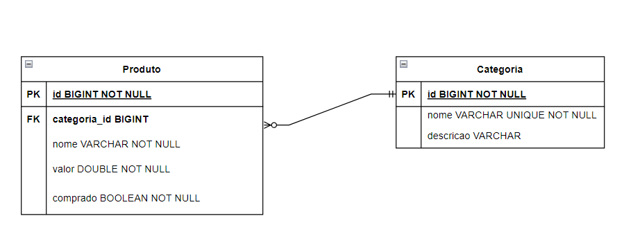

<h1 align="center"> Projeto Lab Supermarket </h1>

       

#### Descrição

Projeto do modulo 3 semana 10 do curso Analista de desenvolvimento Web da instituição Senai.

#### Objetivo:
 criar o back-end de um sistema de lista de compras.
 
#### Documentação do Projeto

- https://documenter.getpostman.com/view/23798743/2s8YzMYQux
 
#### Pré-Requisitos:

- Java 17
- Maven
- PostgreSQL
- Configurar bando de dados

 
#### Configurando banco de dados:
- criar um banco de dados com o nome: LabSupermarket
 
#### Modelo relacional UML

#### Tecnologias utilizadas
- ``Java 17``
- ``SpringBoot 2.7.6``
- ``VSCode``
- ``Postman``
- ``PgAdmin``
- ``Diagrams.net``

#### PLANO DE PROJETO
Ao construir a aplicação proposta, o aluno estará colocando em prática os aprendizados em:

##### Spring:
- ○ Spring Boot: O que é Servlet, Fundamentos do Spring, O que é MVC, DTO,
Autenticação/Segurança/JWT
- ○ Spring Data: Fundamentos, JPA/Hibernate, Model e Repository
- ○ Explorando API Rest: CRUD (GET, POST, PUT, DELETE), Controller, Service e
Repository

##### SQL e Banco de Dados

- ○ Modelo relacional, Overview do PostgreSQL, Instalação e configuração do
ambiente, Comandos DDL (CREATE, ALTER, DROP) e Comandos DML (INSERT,
UPDATE, DELETE, SELECT)

##### Documentação de Back-End:

- ○ Introdução e Boas práticas
